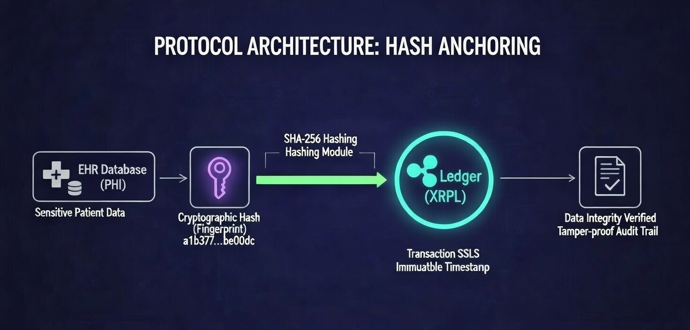

---

## Partner Integration

See PARTNER_ONBOARDING.md for step-by-step integration. Sample API endpoints and BAA template provided.

---

## Troubleshooting

- If you see 'Invalid checksum', regenerate your XRPL seed and ensure it's 51 characters.
- For fiat conversion, ensure gateway_issuer is set and trustlines are established.
- For compliance, see HIPAA_COMPLIANCE.md, GDPR_COMPLIANCE.md, and SECURITY.md.

---

## Quickstart Flows

### Anchor a Record
```python
from solus_sdk import SolusSDK
sdk = SolusSDK(wallet_seed="sEdYourTestnetSeedHere", testnet=True)
record = "Patient: John Doe\nDOB: 1985-03-15\nVisit: 2026-01-20\nDiagnosis: Hypertension, mild"
result = sdk.secure_patient_record(record_text=record, encrypt_first=True, fiat_mode=False)
print(result)
```

### Verify a Record Hash
```python
hash_val = sdk.create_record_hash(record)
print("Record hash:", hash_val)
```

---

# 

## Solus Protocol ($SLS)

**The Immutable Standard for Medical Data Integrity on the XRP Ledger**

[](LICENSE)
[](https://xrpscan.com/token/SLS.r95GyZac4butvVcsTWUPpxzekmyzaHsTA5)
[](WHITEPAPER.md#8-hipaa-regulatory-alignment--technical-safeguards)
[](CONTRIBUTING.md)

---

## Architecture Diagram



---

## Installation

```bash
pip install -r requirements.txt
```

---

## Quickstart Example

```python
from solus_sdk import SolusSDK
sdk = SolusSDK(wallet_seed="sEdYourTestnetSeedHere", testnet=True)
record = "Patient: John Doe\nDOB: 1985-03-15\nVisit: 2026-01-20\nDiagnosis: Hypertension, mild"
result = sdk.secure_patient_record(record_text=record, encrypt_first=True, fiat_mode=False)
print(result)
```

---

## Environment Variables

- `XRPL_RPC_URL` (optional): Set to use a custom XRPL node (e.g., mainnet)
- `SOLUS_API_KEY` (optional): For production/fiat mode

---

## Security Notes

- **Never commit real seeds, secrets, or patient data to version control.**
- Use `.env` files or environment variables for sensitive config.
- All hashes are SHA-256; no PHI is ever stored on-chain.
- For HIPAA compliance, always encrypt PHI before anchoring.

---

## License

Apache License 2.0. See [LICENSE](LICENSE).

---

## Contributing

See [CONTRIBUTING.md](CONTRIBUTING.md) and [CODE_OF_CONDUCT.md](CODE_OF_CONDUCT.md).

---

## Tests

Run all tests with:

```bash
pytest
```

---

## PyPI Publishing

To publish:

```bash
python -m build
python -m twine upload dist/*
```

---

## Contact

support@solusprotocol.com | X: @Solus_Protocol

---

---

## Overview

Solus Protocol is a decentralized infrastructure layer built to bridge legacy Electronic Health Records (EHR) with the transparency of the XRP Ledger. By anchoring cryptographic fingerprints of medical data, we enable real-time validation, auditability, and tamper-proof custody without exposing sensitive Protected Health Information (PHI). 

**NOTE: In the full product phase, the SDK will support both EHR integration mode and standalone mode — allowing providers without existing EHRs to use Solus as a complete, self-contained solution.**

Solus Protocol is designed to establish the standard for secure, patient-controlled medical data integrity in healthcare. We address critical challenges in healthcare data management, such as fragmentation, insecurity, and lack of patient ownership, which cost the US healthcare system approximately $300 billion annually due to mismanagement, redundancies, and inefficiencies (industry estimates, e.g., Persivia 2024 analysis).

Our mission is to empower patients with true data sovereignty while enabling providers (e.g., hospitals like MUSC and SC clinics) to access verifiable, tamper-proof records compliantly and efficiently. Starting with a South Carolina-first approach (headquartered in Mount Pleasant, SC), we prioritize local pilots to drive economic impact before national expansion.

This repository contains a prototype SDK (Software Development Kit) demonstrating core functionality: hashing medical records for integrity, optional encryption for privacy, and storing hashes on XRPL using $SLS as a utility token for fees and incentives. This prototype showcases our progress as an early-stage project and serves as a foundation for production development.

## Key Highlights for Investors, Stakeholders, and VCs

**Problem Solved:** Healthcare data silos lead to errors, delays, privacy breaches, and high costs. Solus fixes this with decentralized integrity, reducing redundancies (e.g., saving providers 20-30% on admin costs) and enabling personalized care.
Differentiation: XRPL's speed (3-5s settlements), low costs (<1 cent/tx), and scalability outperform Ethereum-based competitors. True patient sovereignty + SC-focused entry for quick traction.

**Traction/Validation:** Live mainnet with $SLS token, treasury secured (30M locked), Axelar bridge in progress. Planned SC pilots with MUSC/clinics for real-world testing.
Revenue Model: Primary: SDK subscriptions ($5K-50K/year per provider). Secondary: $SLS utility fees (micro-payments for actions) + incentives. Projected: $250K-600K Year 2, scaling to $12M-60M by Year 5.

**Compliance Focus:** Off-chain PHI storage, encryption, and hash-only on-chain design supports HIPAA. $SLS framed as pure utility (not security) to avoid SEC issues—legal opinions planned with funding.

**VC Appeal:** $11B blockchain healthcare market (2024) → $200B+ by 2030 (CAGR 60%+). Recurring SaaS revenue + network growth in a defensible niche.

For more, see our whitepaper or website: solusprotocol.com. Contact: support@solusprotocol.com | X: @Solus_Protocol

---

## Quick Links
* 📄 **[Whitepaper](WHITEPAPER.md)** - Technical vision, HIPAA alignment, and core protocol logic.
* 🏗️ **[Technical Specs](TECHNICAL_SPECS.md)** - SHA-256 anchoring architecture and XRPL transaction schemas.
* 📈 **[Investor Relations](INVESTOR_RELATIONS.md)** - Tokenomics, roadmap, and ecosystem distribution.
* 🛡️ **[Security Policy](SECURITY.md)** - Responsible disclosure and Safe Harbor guidelines.

---

## 🛠️ Protocol Core Features
* **Immutable Anchoring:** Leverages XRPL transaction memos to create permanent clinical audit trails.
* **Zero-Knowledge Privacy:** Anchors SHA-256 hashes only—ensuring zero patient data is leaked on-chain.
* **Low-Latency Verification:** Validates the integrity of millions of records in seconds using XRPL's high-throughput consensus.
* **Enterprise Interoperability:** Designed for seamless API integration with Epic, Cerner, and other major EHR providers.

---

## How Solus Protocol Works (Utility): 

### Step 1: The Problem in Detail

Healthcare providers struggle with fragmented data across silos (e.g., different EHR systems like Epic/Cerner), leading to:
* Medical errors/delays (e.g., missing records cause redundant tests, costing $100-500/patient).
* Privacy breaches (rising cyber threats; fines $50K-2M/incident).
* No patient control (patients can't easily own/share data).

In SC, this impacts institutions like MUSC (2.4M patients). Solus solves this with blockchain-secured hashes for verifiable integrity.

### Step 2: Core Solution – Hashing for Integrity

We start by creating a "fingerprint" (hash) of the medical record. This ensures immutability: Any change alters the hash, proving tampering. Sensitive PHI stays off-chain (local/encrypted storage) for compliance.

### Example Code for Hashing:

    import hashlib  # Built-in Python tool for hashing

    # Function to hash a patient record
    def create_record_hash(record_text):
        # Turn text into a secure, unique "fingerprint" (hash)
        hash_object = hashlib.sha256(record_text.encode())
        return hash_object.hexdigest()  # Outputs a long string like 'abc123...'
    
    *Example with test data*
    test_record = """
    Patient ID: TEST-987654
    Name: John Doe (fictional test patient)
    Date of Visit: January 19, 2026
    Blood Pressure: 118/76
    Heart Rate: 72 bpm
    Notes: Routine checkup. No issues detected. This is dummy data for Solus Protocol testing only.
    """
    hash_result = create_record_hash(test_record)
    print("Secure Hash (Fingerprint):", hash_result)  # Example: 'd4e567f...etc'

### Step 3: The SDK – Provider Integration Tool

The SDK is a Python library that providers install to integrate Solus into their systems (e.g., Epic/Cerner via APIs). It handles hashing, encryption (for privacy), and XRPL storage. Providers subscribe (USD via Stripe) for access—freemium for betas.

### Full Prototype SDK Code:

    import hashlib
    from cryptography.fernet import Fernet
    from xrpl.clients import JsonRpcClient
    from xrpl.wallet import Wallet
    from xrpl.models.transactions import Payment, TrustSet
    from xrpl.models.amounts import IssuedCurrencyAmount

    # Mock fiat gateway (e.g., simulate Stripe + crypto purchase; in real: use Stripe API + MoonPay/Ramp for USD to $SLS)
    def mock_fiat_to_sls_conversion(usd_amount):
    """Simulate converting USD to $SLS (e.g., via gateway). Returns equivalent $SLS value (hypothetical rate)."""
    sls_rate = 0.05  # Mock: $1 USD = 20 $SLS (adjust based on market)
    sls_purchased = usd_amount / sls_rate
    return sls_purchased  # In real: Call API to buy and transfer to wallet

    class SolusSDK:
    def __init__(self, xrpl_rpc_url="https://s.altnet.rippletest.net:51234/", sls_issuer="r95GyZac4butvVcsTWUPpxzekmyzaHsTA5", encryption_key=None, api_key=None):
        """
        Initialize the SDK.
        - xrpl_rpc_url: XRPL testnet/mainnet URL.
        - sls_issuer: Your $SLS issuer account.
        - encryption_key: Secret key for encrypting sensitive data.
        - api_key: Provider's subscription API key (for USD-based access).
        """
        self.client = JsonRpcClient(xrpl_rpc_url)
        self.sls_issuer = sls_issuer
        self.api_key = api_key  # For subscription validation
        if encryption_key is None:
            self.encryption_key = Fernet.generate_key()
        else:
            self.encryption_key = encryption_key
        self.cipher = Fernet(self.encryption_key)

    def validate_subscription(self):
        """Mock check for active USD subscription via API key."""
        if self.api_key == "valid_mock_key":  # In real: Query Stripe/backend
            return True
        else:
            raise ValueError("Invalid or expired API key. Please subscribe or renew.")

    def encrypt_data(self, data):
        """Encrypt sensitive data (PHI) off-chain for HIPAA support."""
        return self.cipher.encrypt(data.encode()).decode()

    def decrypt_data(self, encrypted_data):
        """Decrypt data (for authorized providers)."""
        return self.cipher.decrypt(encrypted_data.encode()).decode()

    def create_record_hash(self, record_text):
        """Create secure hash of record for immutability."""
        hash_object = hashlib.sha256(record_text.encode())
        return hash_object.hexdigest()

    def setup_trust_line(self, wallet_seed, limit="1000000"):
        """One-time setup for $SLS trust line (allows holding/using token)."""
        wallet = Wallet.from_seed(wallet_seed)
        tx = TrustSet(
            account=wallet.classic_address,
            limit_amount=IssuedCurrencyAmount(currency="SLS", issuer=self.sls_issuer, value=limit)
        )
        response = self.client.submit_and_wait(tx, wallet)
        return response.result

    def store_hash_with_sls_fee(self, hash_value, wallet_seed, fee_sls="0.01", destination="rProtocolTreasury", rebate_sls="0.005", fiat_mode=False, usd_fee_equiv=0.01):
        """
        $SLS Utility: Pay micro-fee in $SLS for action, store hash in memo.
        - If fiat_mode=True, simulate USD payment and auto-convert to $SLS.
        - Deducts fee (revenue to treasury).
        - Sends rebate (incentive).
        """
        if fiat_mode:
            # Simulate USD payment and conversion (providers pay USD, get $SLS)
            sls_needed = float(fee_sls)
            sls_purchased = mock_fiat_to_sls_conversion(usd_fee_equiv)  # Converts USD to $SLS
            if sls_purchased < sls_needed:
                raise ValueError("Insufficient $SLS from fiat conversion. Top up subscription.")
            print(f"Simulated USD payment: Purchased {sls_purchased} $SLS for fee.")

        wallet = Wallet.from_seed(wallet_seed)
        
        # Pay $SLS fee with hash memo
        amount_sls = IssuedCurrencyAmount(currency="SLS", issuer=self.sls_issuer, value=fee_sls)
        tx_fee = Payment(
            account=wallet.classic_address,
            amount=amount_sls,
            destination=destination,
            memos=[{"memo": {"memo_data": hash_value}}]
        )
        fee_response = self.client.submit_and_wait(tx_fee, wallet)
        
        # Rebate: Send back $SLS
        rebate_amount = IssuedCurrencyAmount(currency="SLS", issuer=self.sls_issuer, value=rebate_sls)
        tx_rebate = Payment(
            account=destination,
            amount=rebate_amount,
            destination=wallet.classic_address
        )
        rebate_response = {"mock": "Rebate sent"}  # In real: Submit with treasury wallet

        return {"fee_tx": fee_response.result, "rebate": rebate_response}

    def secure_patient_record(self, record_text, wallet_seed, encrypt_first=False, fiat_mode=False):
        """Full workflow: Validate sub, encrypt (optional), hash, store on XRPL with $SLS fee (fiat optional)."""
        self.validate_subscription()  # Check USD sub
        if encrypt_first:
            record_text = self.encrypt_data(record_text)
        hash_val = self.create_record_hash(record_text)
        tx_results = self.store_hash_with_sls_fee(hash_val, wallet_seed, fiat_mode=fiat_mode)
        return {"hash": hash_val, "tx_results": tx_results}

    # Usage Example (Provider Side – Crypto Critic with Fiat Mode)
    sdk = SolusSDK(api_key="valid_mock_key")  # Provider's USD sub key
    test_record = "Patient data here"
    test_seed = "sTestSeed"  # Still needs wallet for XRPL, but fiat handles $SLS
    result = sdk.secure_patient_record(test_record, test_seed, encrypt_first=True, fiat_mode=True)
    print(result)
    
### Step 4: Real-World Use & $SLS Utility

* **Provider Implementation:** Install via [pip install solus-sdk] (once packaged). Setup trust line once. Call [secure_patient_record()] in their EHR workflow—hashes/stores automatically.

* **$SLS as Fuel:** In [store_hash_with_sls_fee], $SLS deducts for the transaction (utility payment to treasury—your revenue). Providers pay USD subscriptions; SDK auto-handles $SLS conversion. Rebates encourage use. Trading adds liquidity but revenue is from fees.

* **Path to Profitability:** Subscriptions for SDK access; $SLS fees (10-20% to treasury) scale with adoption. Pilots prove value, leading to paid tiers.

### Installation

Install dependencies: [pip install cryptography xrpl-py]
Run the code: Import and use as shown.

### Compliance & Legal

Design supports HIPAA (off-chain PHI, encryption). $SLS as utility token (not security). Funding will enable full audits.

---

## Asset Information & Governance

| Attribute | Details |
| :--- | :--- |
| **Token Name** | Solus Protocol |
| **Symbol** | $SLS |
| **Network** | XRP Ledger (XRPL) |
| **Issuer Address** | `r95GyZac4butvVcsTWUPpxzekmyzaHsTA5` |
| **Total Supply** | 100,000,000 SLS (maximum issued; no additional minting without owner action) |
| **Circulating/Issued Supply** | ~69,999,909 SLS (current on XRPL Mainnet; Base ERC-20 representation aligned via burn) |
| **Liquidity** | **Decentralized AMM Pools Enabled** |
| **Utility** | Data Anchoring, Validation, Governance |

### **Official Trust Line**
To hold or trade $SLS, you must establish a trust line to the official issuer address.
> **[Set Trustline via Xaman (Xumm)](https://xumm.community/?issuer=r95GyZac4butvVcsTWUPpxzekmyzaHsTA5&currency=SLS&limit=1000000000)**

---

## Ecosystem Participation & Stakeholders

### **Trading & Liquidity**
Instant liquidity is available via the native XRPL Automated Market Maker (AMM):
* **Swap on Magnetic:** [Swap XRP/SLS](https://xpmarket.com/amm/pool/SLS-r95GyZac4butvVcsTWUPpxzekmyzaHsTA5/XRP)
* **Market Analytics:** [View on XPMarket](https://xmagnetic.org/amm/SLS+r95GyZac4butvVcsTWUPpxzekmyzaHsTA5_XRP+XRP?network=mainnet)

### **Developer Support**
We welcome contributions to the Solus Protocol Gateway API and open-source EHR connectors. 
* See **[CONTRIBUTING.md](CONTRIBUTING.md)** to get started.
* For critical vulnerabilities, refer to our **[Security Policy](SECURITY.md)**.

---

## 🔗 Official Channels
* **Twitter:** [@solus_protocol](https://x.com/solus_protocol)
* **Telegram:** [t.me/solus_protocol](https://t.me/solus_protocol)
* **Explorer:** [XRPScan Token Profile](https://xrpscan.com/account/r95GyZac4butvVcsTWUPpxzekmyzaHsTA5)

---

© 2026 Solus Protocol. All rights reserved. 

Disclaimer: Solus Protocol is a data integrity tool. It does not provide medical advice or diagnosis. Users are responsible for ensuring compliance with local healthcare regulations (e.g., HIPAA/GDPR).  $SLS is a utility token and does not represent equity or an investment contract.
